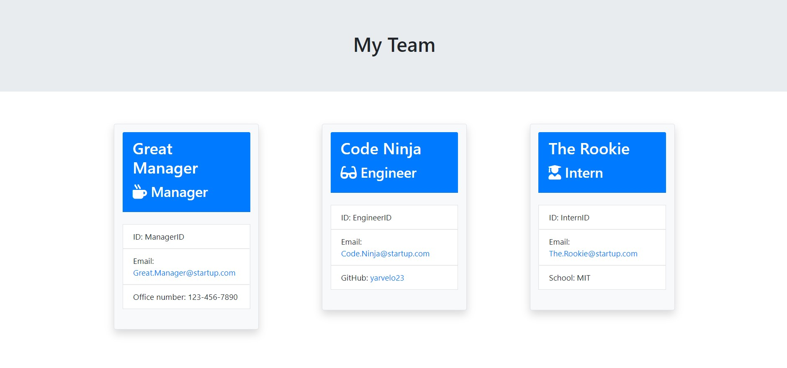

  # **Template Engine - Employee Summary**

 

  ## Description

  This project consists of a Node CLI (Command Line Interface) that takes in information about employees and generates an HTML webpage that displays summaries for each person.  

  

  ## Table of contents

  - [Description](#Description)
  - [Application-Video](#ApplicationDemo)
  - [Installation](#Installation)
  - [Usage](#Usage)
  - [License](#License)
  - [Contributors](#Contributors)
  - [Test](#Test)
  - [Repository Link](#Repository)
  - [GitHub Info](#GitHub)

  ## Application Video

  [Video Link](https://drive.google.com/file/d/1lka7XzRNmPGDir3zfOFHDzLop92B6Uq7/view)
  
  ## Installation
  
    npm i followed by node app.js

  ## Usage

    To quickly and efficiently generate a team profile page containing information about each employee. 

  
  ## Contributors

    Yerson Arvelo
  
  ## Test
  
    Employee.test, Engineer.test, Intern.test, Manager.test
  
  ## Repository

  - [Project Repo](https://github.com/yarvelo23/employee-profile-engine)

